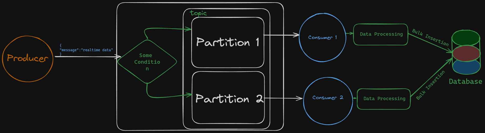

### Kafka Architecture Diagram
Here is a basic diagram of Kafka's architecture:



# Key Points for Designing Systems with Kafka

1. **Partition Consumption**: Each partition within a topic is consumed by only one consumer within a consumer group, ensuring streamlined and efficient data processing.

2. **Consumer Handling**: A single consumer can handle data from multiple partitions, enabling seamless management of data from multiple sources even with just one consumer.

3. **Optimal Resource Utilization**: If there are more consumers than partitions, the additional consumers remain idle, ensuring optimal resource utilization.

4. **Consumer Group Workload**: In consumer groups, consumers divide the workload. For instance, a single consumer in one group can handle multiple partitions, while in another group, multiple consumers share the partitions.

## Practical Kafka Implementation

### Setting Up Kafka Environment

1. **Running Zookeeper**:
Remember it’s run on port 2181 by default and we are mapping that port to our local machine and we are getting the zookeeper image and we are pulling the image.

```
   docker run -p 2181:2181 zookeeper
```
2. **We need to now run the Kafka itself.**
```
docker run -p 9092:9092 \
-e KAFKA_ZOOKEEPER_CONNECT=<YOUR_IP_ADDRESS>:2181 \
-e KAFKA_ADVERTISED_LISTENERS=PLAINTEXT://<YOUR_IP_ADDRESS>:9092 \
-e KAFKA_OFFSETS_TOPIC_REPLICATION_FACTOR=1 \
confluentinc/cp-kafka
```

Create a empty folder and it’s better to create a new environment before starting anything in python.
```
python3 -m venv env
```

3. Installation of Python client inside the virual environment:

```
pip install confluent-kafka
```

